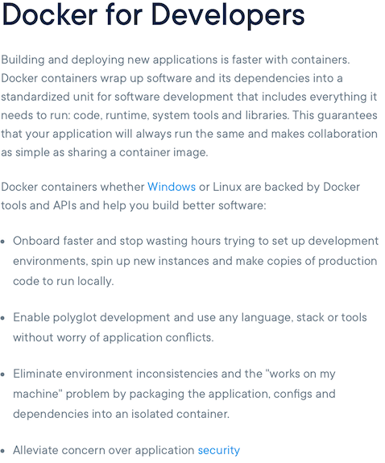

import { Head, Appear, Image } from 'mdx-deck'  // https://github.com/jxnblk/mdx-deck
import { Invert, Split } from 'mdx-deck/layouts'
import { CodeSurfer } from 'mdx-deck-code-surfer' // https://elijahmanor.com/code-surfer/

# Set up your own GraphQL sandbox using Docker
<Head>
  <title>Set up your own GraphQL sandbox using Docker</title>
</Head>

Rob Brennan

@therobbrennan | [rob@therobbrennan.com](mailto:rob@therobbrennan.com)

---
# Introduction

---
# Background

---
# Learning GraphQL

[](https://www.amazon.com/Learning-GraphQL-Declarative-Fetching-Modern/dp/1492030716)

---
# The Road to GraphQL

[](https://www.robinwieruch.de/the-road-to-graphql-book/)

---
# Let's get started
All code in this presentation is available at [https://github.com/TheRobBrennan/learning-graphql](https://github.com/TheRobBrennan/learning-graphql)

---
# What will we need?

<ul style={{listStyle: 'none'}}>
  <Appear>
    <li>A back-end MongoDB database server</li>
    <li>A back-end server for GraphQL and other APIs</li>
    <li>A simple web application to use our GraphQL API</li>
  </Appear>
</ul>

---
# What would be a bonus?

<ul style={{listStyle: 'none'}}>
  <Appear>
    <li>Lightweight tools to explore our GraphQL API</li>
    <li>Multiple front-end applications using our GraphQL</li>
    <li>The ability to use GitHub to sign in and out of our application</li>
  </Appear>
</ul>

---
# Good news!
## We can do it all.

---
# Our goal
<ul style={{listStyle: 'none'}}>
  <Appear>
    <li>Create an easy to spin up environment for GraphQL</li>
  </Appear>
</ul>

---
# What are we working with?


---
# Virtual machines
"Virtual machines (VMs) are an abstraction of physical hardware turning one server into many servers. 

Each VM includes a full copy of an operating system, the application, necessary binaries and libraries - taking up tens of GBs. VMs can also be slow to boot."

[https://www.docker.com/resources/what-container](https://www.docker.com/resources/what-container)

```notes
One approach might be to use virtual machines for our application.
```

---
<Image src='./images/virtual-machines-each-with-an-individual-app.png' size='50%' />

```notes
We could have multiple machines or virtual machines that run these apps/services individually...

How might we scale this? We could add more virtual machines if our back-end server is being hammered; ditto for other services.

As you might imagine, not only is this expensive but it introduces all kinds of room for error. One person might be working on the front-end app and it's good. Someone else is working on the back-end. While "it works fine for me" is true in both cases, something is slightly off in production and bam - the project is broken, and both people see working code.
```

---
# VMs have their place

<ul style={{listStyle: 'none'}}>
  <Appear>
    <li>...but what if we used Docker and containerized our apps/services?</li>
  </Appear>
</ul>

---
# Remember?


```notes
Aha! We have four discrete apps/services we want to work with. Imagine we named each container AppA, AppB, AppC, AppD, etc...
```
---
<Image src='./images/docker-containerized-applictions.png' size='60%' />

```notes
What is a container, exactly?
```
---
# Docker
"A Docker container image is a lightweight, standalone, executable package of software that includes everything needed to run an application: code, runtime, system tools, system libraries and settings."

[https://www.docker.com/resources/what-container](https://www.docker.com/resources/what-container)

```notes
With Docker, we can have our apps/services existing as separate containers (instances of an image - which is merely a recipe for creating the app or service)

How might we be able to scale our solution?

We can have one host - a laptop, a server in the cloud, multiple servers appearing to act as a single host, etc - and define as many containers as we want. Imagine a case where our architecture is ready to support scaling such that we have two containers for each front-end app, three containers for the back-end API, and maybe five MongoDB services in a cluster.

```

---
export default Split



[READ: Get started](https://www.docker.com/get-started)

---
# Project checklist

<ul style={{listStyle: 'none', textAlign: 'left', margin: 0, padding: 0}}>
  <li>Initial setup of MongoDB for Docker</li>
  <li>Initial setup of our back-end server for Docker</li>
  <li>Initial setup of our front-end applications for Docker</li>
  <li>Bring everything together</li>
  <li>Explore GraphQL</li>
</ul>

---
# Initial MongoDB setup

```notes
Let's look at our project structure...there's nothing in here about MongoDB? There must be a reason...stay tuned.
```

---
# Project checklist

<ul style={{listStyle: 'none', textAlign: 'left', margin: 0, padding: 0}}>
  <li><s>Initial setup of MongoDB for Docker</s></li>
  <li>Initial setup of our back-end server for Docker</li>
  <li>Initial setup of our front-end applications for Docker</li>
  <li>Bring everything together</li>
  <li>Explore GraphQL</li>
</ul>

---
# Initial back-end server setup
Our back-end server is located at `./photo-share-api`

---
<CodeSurfer
  code={require("raw-loader!./snippets/dockerfile-photo-share-api.snippet")} 
  title="Dockerfile for photo-share-api"
  showNumbers
  steps={[
    {}, // First step should be an overview of the snippet
    {lines: [1], notes: "Specify the base Node.js image"},
    {range: [6,7], notes: "Create the working directory on our process"},
    {range: [9,11], notes: "Copy and install our dependencies just like we would locally"},
    {range: [13,14], notes: "Copy our application code over"},
    {lines: [15], notes: "What is this? It seems a little...unusual."},
    {range: [17,19], notes: "We need to define ports for Docker to access"},
    {range: [21,22], notes: "This is the command to start our back-end server"},
    {}
  ]}
/>

---
# Project checklist

<ul style={{listStyle: 'none', textAlign: 'left', margin: 0, padding: 0}}>
  <li><s>Initial setup of MongoDB for Docker</s></li>
  <li><s>Initial setup of our back-end server for Docker</s></li>
  <li>Initial setup of our front-end applications for Docker</li>
  <li>Bring everything together</li>
  <li>Explore GraphQL</li>
</ul>

---
# Initial front-end application setup
This project contains two front-end applications

`photo-share-client` and `nextjs-with-apollo`

```notes
photo-share-client is the project created for the Learning GraphQL book.

nextjs-with-apollo is the project I created to explore NextJS and GraphQL.
```

---
# photo-share-client

---
<CodeSurfer
  code={require("raw-loader!./snippets/dockerfile-photo-share-client.snippet")} 
  title="Dockerfile for photo-share-client"
  showNumbers
  steps={[
    {}, // First step should be an overview of the snippet
    {lines: [1], notes: "Specify the base Node.js image"},
    {range: [6,7], notes: "Create the working directory on our process"},
    {range: [9,11], notes: "Copy and install our dependencies just like we would locally"},
    {range: [13,14], notes: "Copy our application code over"},
    {range: [16,17], notes: "We need to define ports for Docker to access"},
    {range: [19,20], notes: "This is the command to start our React application"},
    {}
  ]}
/>

---
# nextjs-with-apollo

---
<CodeSurfer
  code={require("raw-loader!./snippets/dockerfile-nextjs-with-apollo.snippet")} 
  title="Dockerfile for nextjs-with-apollo"
  showNumbers
  steps={[
    {}, // First step should be an overview of the snippet
    {lines: [1], notes: "Specify the base Node.js image"},
    {range: [5,6], notes: "Create the working directory on our process"},
    {range: [8,10], notes: "Copy and install our dependencies just like we would locally"},
    {range: [12,13], notes: "Copy our application code over"},
    {range: [15,16], notes: "Build our NextJS app"},
    {range: [18,19], notes: "We need to define ports for Docker to access"},
    {range: [21,22], notes: "This is the command to start our NextJS application in development mode *"},
    {}
  ]}
/>

```notes
Wait. We built the application, and we're still starting it in development mode?

Hang in there. You'll see why shortly.
```

---
# Project checklist

<ul style={{listStyle: 'none', textAlign: 'left', margin: 0, padding: 0}}>
  <li><s>Initial setup of MongoDB for Docker</s></li>
  <li><s>Initial setup of our back-end server for Docker</s></li>
  <li><s>Initial setup of our front-end applications for Docker</s></li>
  <li>Bring everything together</li>
  <li>Explore GraphQL</li>
</ul>

---
# Docker Compose

---
<CodeSurfer
  code={require("raw-loader!./snippets/docker-compose.snippet")} 
  title="Docker Compose"
  showNumbers
  steps={[
    {}, // First step should be an overview of the snippet
  ]}
/>

---
<CodeSurfer
  code={require("raw-loader!./snippets/docker-compose-mongodb.snippet")} 
  title="Docker Compose: MongoDB"
  showNumbers
  steps={[
    {}, // First step should be an overview of the snippet
    {lines: [1], notes: ""},
    {lines: [2], notes: ""},
    {lines: [3], notes: ""},
    {range: [4,6], notes: ""},
    {range: [7,9], notes: ""},
    {range: [10,11], notes: ""},
    {lines: [11], notes: ""},
  ]}
/>

---
<CodeSurfer
  code={require("raw-loader!./snippets/docker-compose-graphql-api.snippet")} 
  title="Docker Compose: Our back-end server"
  showNumbers
  steps={[
    {}, // First step should be an overview of the snippet
    {lines: [1], notes: ""},
    {range: [2,4], notes: ""},
    {lines: [5], notes: ""},
    {range: [6,9], notes: ""},
    {range: [10,12], notes: ""},
    {range: [13,15], notes: ""},
    {range: [16,17], notes: ""},
  ]}
/>

---
<CodeSurfer
  code={require("raw-loader!./snippets/docker-compose-graphql-web.snippet")} 
  title="Docker Compose: The original React app"
  showNumbers
  steps={[
    {}, // First step should be an overview of the snippet
    {lines: [1], notes: ""},
    {range: [2,4], notes: ""},
    {lines: [5], notes: ""},
    {lines: [6], notes: ""},
    {range: [7,8], notes: ""},
    {range: [9,11], notes: ""},
    {range: [12,13], notes: ""},
  ]}
/>

---
<CodeSurfer
  code={require("raw-loader!./snippets/docker-compose-graphql-nextjs.snippet")} 
  title="Docker Compose: NextJS with Apollo"
  showNumbers
  steps={[
    {}, // First step should be an overview of the snippet
    {lines: [1], notes: ""},
    {range: [2,4], notes: ""},
    {lines: [5], notes: ""},
    {range: [6,9], notes: ""},
    {range: [10,11], notes: ""},
    {range: [12,14], notes: ""},
    {range: [15,16], notes: ""},
  ]}
/>

---
<CodeSurfer
  code={require("raw-loader!./snippets/docker-compose.snippet")} 
  title="Behold!"
  showNumbers
  steps={[
    {}, // First step should be an overview of the snippet
  ]}
/>

```notes
Tada! Let's take a look at our docker-compose file one last time before issuing the magic command...
```

---
# Project checklist

<ul style={{listStyle: 'none', textAlign: 'left', margin: 0, padding: 0}}>
  <li><s>Initial setup of MongoDB for Docker</s></li>
  <li><s>Initial setup of our back-end server for Docker</s></li>
  <li><s>Initial setup of our front-end applications for Docker</s></li>
  <li><s>Bring everything together</s></li>
  <li>Explore GraphQL</li>
</ul>

---
# Bring everything together


---
# Let's go
`$ npm run docker:up`

(This will take a few minutes, so let's switch to the demo)

---
# Demo
export default Invert

---
# Thank you

Rob Brennan | [rob@therobbrennan.com](mailto:rob@therobbrennan.com)

[https://github.com/TheRobBrennan/learning-graphql](https://github.com/TheRobBrennan/learning-graphql)
